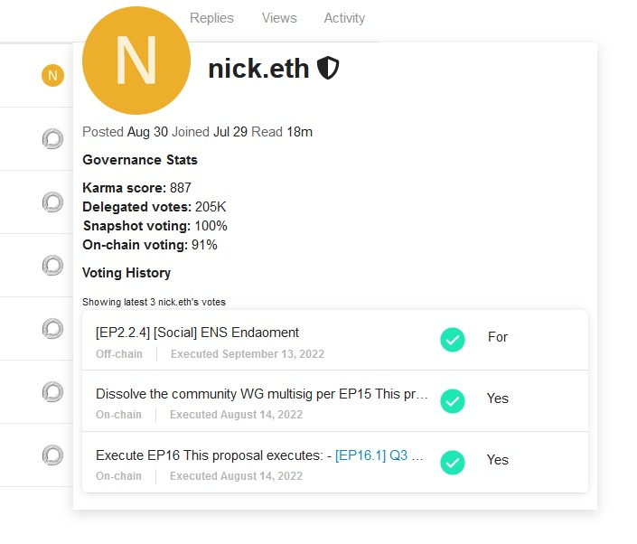
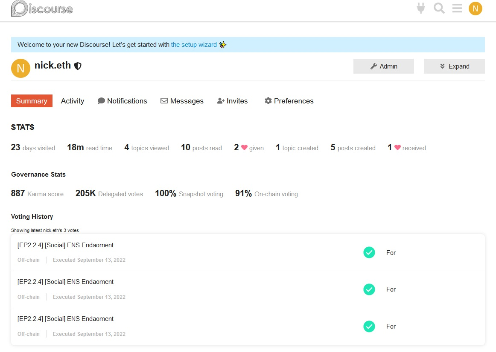
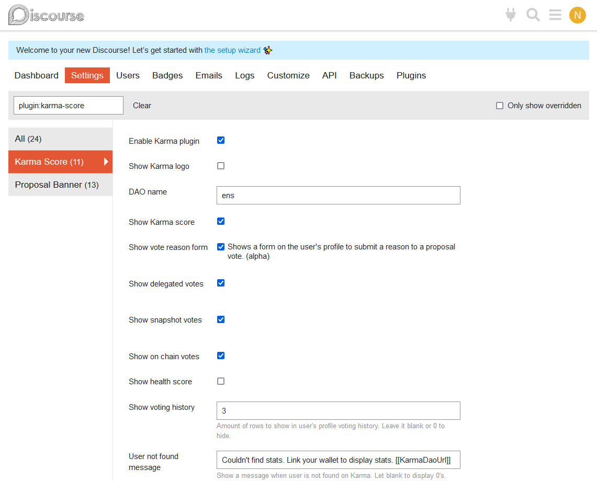
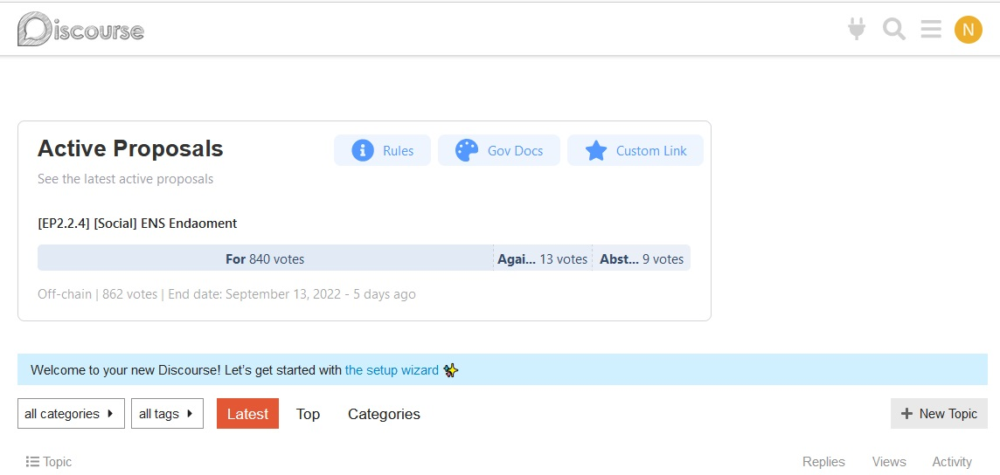
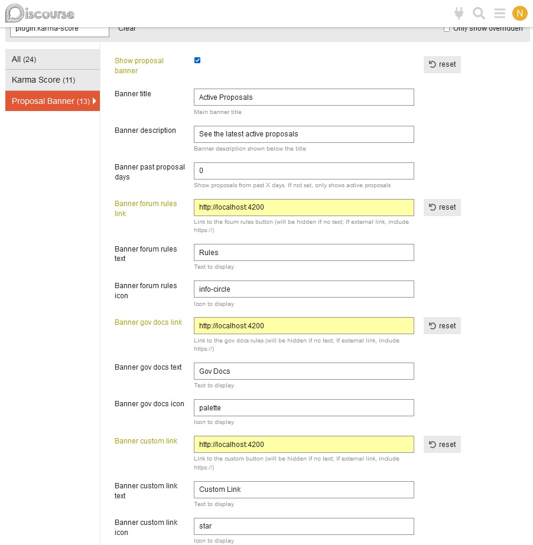
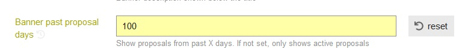
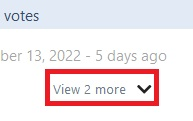
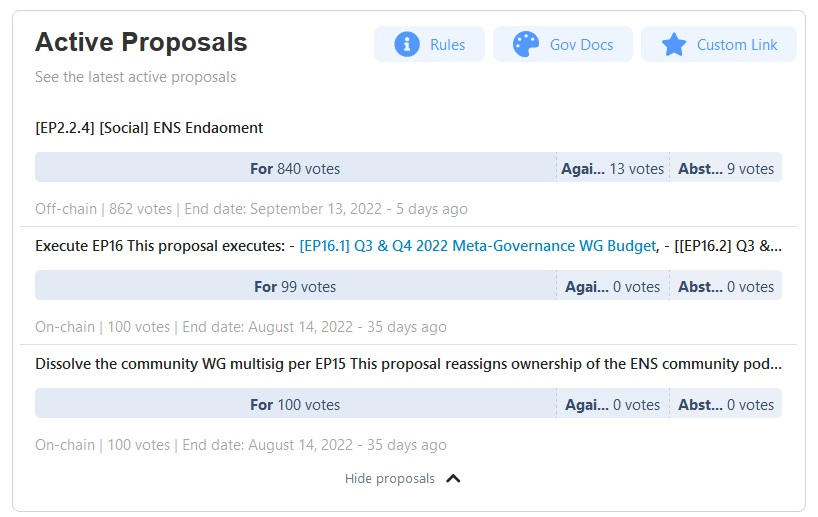

# **Karma Score** Discourse Plugin

## Plugin Summary

Karma discourse plugin can be used by DAOs on their forum to display forum user's governance stats, and active proposals for the dao.

## Installation

 This plugin can be installed on both self-hosted instances and managed hosting. We have experience working with managed hosting providers to install our plugin. If you need help with installation, contact us at info@showkarma.xyz

__Step 1__: To install the plugin, you can follow the [Install Plugins in Discourse](https://meta.discourse.org/t/install-plugins-in-discourse/19157) official instructions.

__Step 2__: After the installation, the user should go to the plugins page (Admin -> Plugins) and hit Settings under `Karma` plugin. Then, set the Dao Name as registered at [Karma](https://showkarma.xyz).

---

## Karma Score

The Karma Score plugin uses the forum username of users to search for metadata in Karma API, showing stats we gather in the user profile, such as **Karma score, Gitcoin Health score, Delegated votes, Snapshot voting stats** and **On-chain voting stats**.

These stats will be shown at:

1. Profile card
   

2. Profile Summary page
   

---
### Settings 

Score settings are simple and easy to manage, making possible for the admin to choose which stats to show by ticking the checkboxes in the settings page (_note that health score works only for Gitcoin Dao_). Also, it's possible to change how many votes are desired to show in the card and profile summary by changing `Show voting history` field.

---
## Proposals Banner

The proposal banner is a widget that shows active and past proposals from a DAO. (_Note that this setting will use the __Karma Score DAO Name__ to search for proposals so make sure that you set it before start_)

The banner is provided with some options to customise the UI, such as:

__Banner past proposal days__: adjust the number of days before today to show proposals. If it's set to 0, it'll only show proposals that end after the current time, and if not, it will show proposals that have already ended, indicated by the number of days since the end of that proposal.

If the banner has more than one proposal to show, it'll show an icon indicating that some proposals are hidden,

and can be shown by clicking that button[]

__Banner links__: Three custom links to send the user to somewhere you want, like a document, an external website, a post, etc. It's also possible to change the display icon with [FontAwesome](https://fontawesome.com/v5/search) icon names. If the title of the link is blank, the button will be hidden.

> After modifying settings, always refresh the page to ensure that the new configurations are loaded and the plugin is ready.
