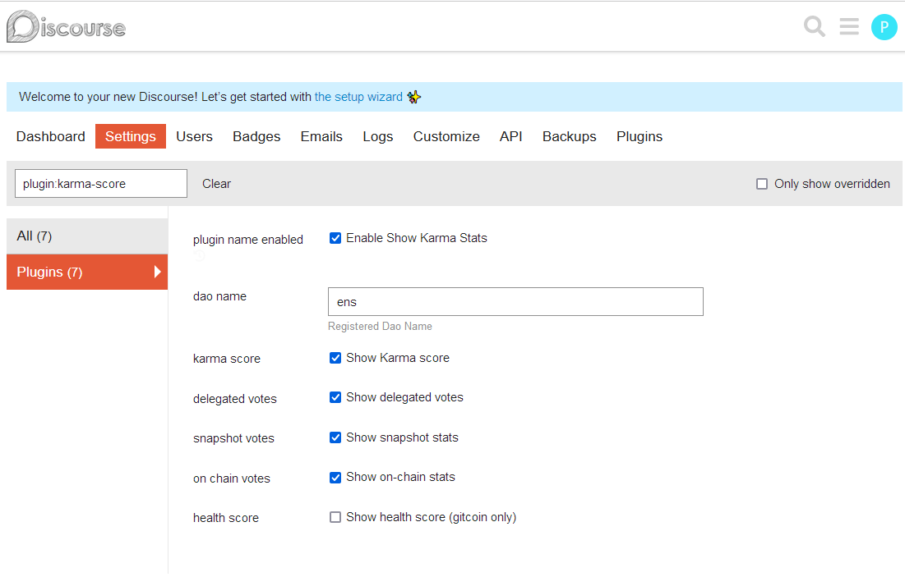
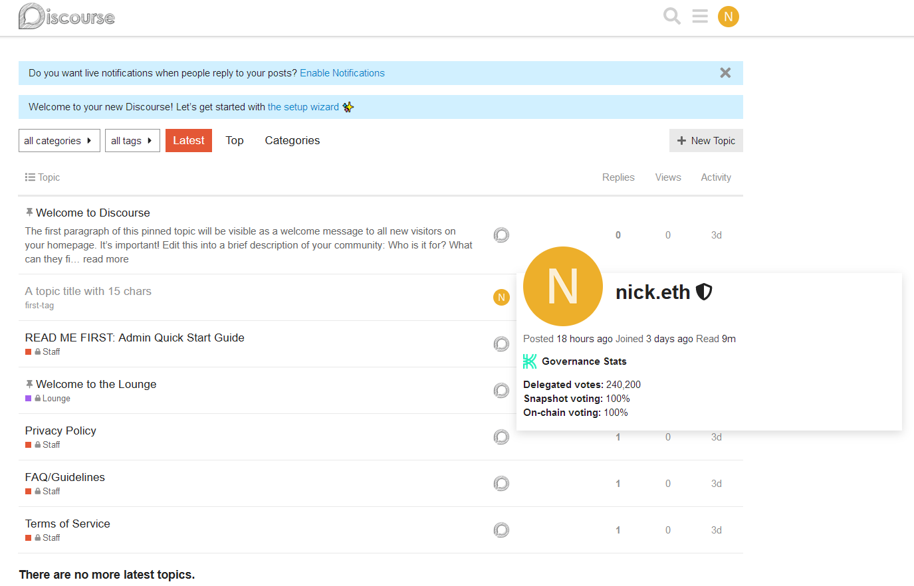

# **Karma Score** Discourse Plugin

**Plugin Summary**

Karma discourse plugin can be used by DAOs on their forum to display forum user's governance stats. This plugin can be installed on both self-hosted instances and managed hosting.

**We have experience working with managed hosting providers to install our plugin. If you need help with installation, contact us at info@showkarma.xyz
**
__Step 1__: To install the plugin, you can follow the [Install Plugins in Discourse](https://meta.discourse.org/t/install-plugins-in-discourse/19157) official instructions.

__Step 2__: After the installation, the user should go to the plugins page (Admin -> Plugins) and hit Settings under `Karma` plugin. Then, set the Dao Name as registered at [Karma](https://showkarma.xyz).

> After these two steps, refresh the page to ensure that the new configurations are loaded and the plugin is ready. The admin can also choose which stats to show by ticking the checkboxes in the settings page (_note that health score works only for Gitcoin Dao_).

---

## How does it work?

The Karma Score plugin uses the forum username of users to search for metadata in our API, showing stats we gather in the user profile, such as **Karma score, Gitcoin Health score, Delegated votes, Snapshot voting stats** and **On-chain voting stats**.

These stats will be shown at:

1. Profile card
   

2. Profile Summary page
   

